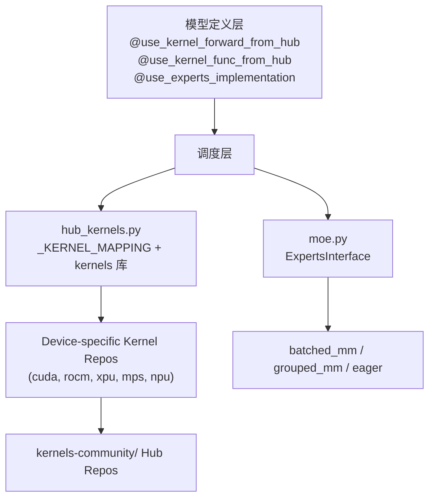
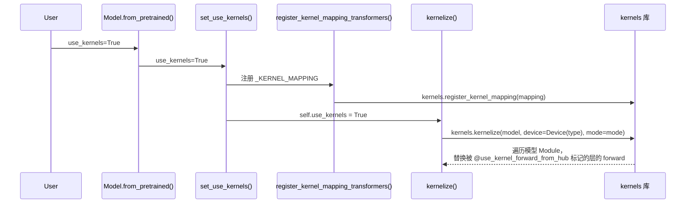
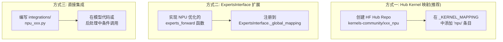

# Transformers Kernels 子系统架构分析与 NPU Ascend 适配指南

## 1. 概述

HuggingFace Transformers 的 kernel 子系统为模型中的关键算子（如 RMSNorm、MoE GMM、Activation、Rotary Embedding 等）提供了 **可替换的高性能融合实现**。该系统通过一个分层架构来管理设备特定的 kernel 分发：



---

## 2. 核心文件索引

| 文件 | 作用 |
|---|---|
| [hub_kernels.py](file:///Users/humphrey/Documents/transformers/src/transformers/integrations/hub_kernels.py) | Hub 内核映射表 `_KERNEL_MAPPING`、kernel 装饰器、[kernelize()](file:///Users/humphrey/Documents/transformers/src/transformers/modeling_utils.py#4445-4455)所需的注册逻辑 |
| [moe.py](file:///Users/humphrey/Documents/transformers/src/transformers/integrations/moe.py) | MoE Experts 前向实现 ([batched_mm](file:///Users/humphrey/Documents/transformers/src/transformers/integrations/moe.py#103-169), [grouped_mm](file:///Users/humphrey/Documents/transformers/src/transformers/integrations/moe.py#271-300)) 及 [ExpertsInterface](file:///Users/humphrey/Documents/transformers/src/transformers/integrations/moe.py#425-446) 分发 |
| [npu_flash_attention.py](file:///Users/humphrey/Documents/transformers/src/transformers/integrations/npu_flash_attention.py) | 已有的 NPU FlashAttention 适配 |
| [modeling_utils.py](file:///Users/humphrey/Documents/transformers/src/transformers/modeling_utils.py) | [set_use_kernels()](file:///Users/humphrey/Documents/transformers/src/transformers/modeling_utils.py#3657-3695) / [kernelize()](file:///Users/humphrey/Documents/transformers/src/transformers/modeling_utils.py#4445-4455) / [from_pretrained()](file:///Users/humphrey/Documents/transformers/src/transformers/modeling_utils.py#3696-4181) 中的 kernel 加载入口 |
| [import_utils.py](file:///Users/humphrey/Documents/transformers/src/transformers/utils/import_utils.py) | [is_kernels_available()](file:///Users/humphrey/Documents/transformers/src/transformers/utils/import_utils.py#624-628) — 检查 [kernels](file:///Users/humphrey/Documents/transformers/src/transformers/modeling_utils.py#4456-4459) pip 包可用性 |
| [generic.py](file:///Users/humphrey/Documents/transformers/src/transformers/utils/generic.py) | [GeneralInterface](file:///Users/humphrey/Documents/transformers/src/transformers/utils/generic.py#939-978) — [ExpertsInterface](file:///Users/humphrey/Documents/transformers/src/transformers/integrations/moe.py#425-446) 和 `ALL_ATTENTION_FUNCTIONS` 的基类 |

---

## 3. Kernel 调用逻辑详解

### 3.1 Hub Kernel 系统 (Layer-Level Replacement)

这是最核心的 kernel 分发机制，基于 HuggingFace 的 [kernels](file:///Users/humphrey/Documents/transformers/src/transformers/modeling_utils.py#4456-4459) 第三方库。

#### 3.1.1 注册映射表 `_KERNEL_MAPPING`

在 [hub_kernels.py L87-L232](file:///Users/humphrey/Documents/transformers/src/transformers/integrations/hub_kernels.py#L87-L232) 中定义了一个全局字典 `_KERNEL_MAPPING`，结构如下：

```python
_KERNEL_MAPPING = {
    "RMSNorm": {
        "cuda": { Mode.INFERENCE: LayerRepository(repo_id="kernels-community/liger_kernels", layer_name="LigerRMSNorm") },
        "rocm": { Mode.INFERENCE: LayerRepository(repo_id="kernels-community/liger_kernels", layer_name="LigerRMSNorm") },
        "xpu":  { Mode.INFERENCE: LayerRepository(repo_id="kernels-community/rmsnorm", layer_name="RMSNorm") },
        "mps":  { Mode.INFERENCE: LayerRepository(repo_id="kernels-community/mlx_rmsnorm", layer_name="RMSNorm") },
        "npu":  { Mode.INFERENCE: LayerRepository(repo_id="kernels-community/liger_kernels", layer_name="LigerRMSNorm") },
    },
    "MegaBlocksMoeMLP": {
        "cuda": { Mode.TRAINING: LayerRepository(...), Mode.INFERENCE: LayerRepository(...) },
        "rocm": { Mode.INFERENCE: LayerRepository(...) },
        "xpu":  { Mode.INFERENCE: LayerRepository(...) },
        "cpu":  { Mode.INFERENCE: LayerRepository(..., layer_name="CPUMegaBlocksMoeMLP") },
    },
    "Llama4TextMoe": { "cuda": LayerRepository(repo_id="kernels-community/moe", ...) },
    "FastGELU": { "cuda": { Mode.INFERENCE | Mode.TORCH_COMPILE: LayerRepository(...) } },
    "QuickGELU": { ... },
    "NewGELU": { ... },
    "SiLU": { ... },
    "GeLU": { ... },
    "GeluTanh": { ... },
    "rotary_pos_emb": {  # FuncRepository (函数级别)
        "xpu":  { Mode.INFERENCE: FuncRepository(...) },
        "cuda": { Mode.INFERENCE: FuncRepository(...) },
    },
}
```

> [!IMPORTANT]
> 映射表的 **key** 是 kernel 的逻辑名称（如 `"RMSNorm"`），必须与模型代码中 `@use_kernel_forward_from_hub("RMSNorm")` 装饰器的参数匹配。**value** 是按设备类型+运行模式(`Mode.INFERENCE` / `Mode.TRAINING`)的嵌套字典。

#### 3.1.2 模型侧装饰器

模型代码使用两种装饰器声明"此层/函数可被 hub kernel 替换"：

**`@use_kernel_forward_from_hub("RMSNorm")`** — 替换整个 `nn.Module.forward`：

```python
# 例: deepseek_v3/modeling_deepseek_v3.py
@use_kernel_forward_from_hub("RMSNorm")
class DeepseekV3RMSNorm(nn.Module):
    def forward(self, hidden_states):
        ...  # 默认 eager 实现（作为 fallback）
```

**`@use_kernel_func_from_hub("rotary_pos_emb")`** — 替换纯函数：

```python
@use_kernel_func_from_hub("rotary_pos_emb")
def apply_rotary_pos_emb(q, k, cos, sin, unsqueeze_dim=1):
    ...  # 默认 eager 实现
```

目前约 **60+ 个模型** 使用 `@use_kernel_forward_from_hub("RMSNorm")`，约 **50+ 个模型** 使用 `@use_kernel_func_from_hub("rotary_pos_emb")`。

#### 3.1.3 触发加载的调用链



关键代码在 [modeling_utils.py:set_use_kernels()](file:///Users/humphrey/Documents/transformers/src/transformers/modeling_utils.py#L3657-L3694):

```python
def set_use_kernels(self, use_kernels, kernel_config=None):
    if use_kernels:
        register_kernel_mapping_transformers()  # 注册映射表到 kernels 库
        # ...
        self.use_kernels = True  # → 触发 kernelize()

def kernelize(self, mode=None):
    from kernels import Device, Mode, kernelize
    mode = Mode.INFERENCE if not self.training else Mode.TRAINING
    kernelize(self, device=Device(type=self.device.type), mode=mode)
```

> [!NOTE]
> [kernels](file:///Users/humphrey/Documents/transformers/src/transformers/modeling_utils.py#4456-4459) 库会根据 `Device(type=self.device.type)` 自动从 `_KERNEL_MAPPING` 中选取对应设备的 [LayerRepository](file:///Users/humphrey/Documents/transformers/src/transformers/integrations/hub_kernels.py#265-268)，然后从 HuggingFace Hub 下载编译好的 kernel 并替换 forward 方法。

---

### 3.2 MoE Experts 分发系统

这是一个独立于 hub kernel 系统的 **函数级别分发机制**，专门用于 MoE 模型中 expert forward 的实现选择。

#### 3.2.1 [ExpertsInterface](file:///Users/humphrey/Documents/transformers/src/transformers/integrations/moe.py#425-446) 注册

在 [moe.py L425-L448](file:///Users/humphrey/Documents/transformers/src/transformers/integrations/moe.py#L425-L448) 中:

```python
class ExpertsInterface(GeneralInterface):
    _global_mapping = {
        "batched_mm": batched_mm_experts_forward,   # 使用 torch.bmm
        "grouped_mm": grouped_mm_experts_forward,   # 使用 torch.nn.functional.grouped_mm
    }

ALL_EXPERTS_FUNCTIONS = ExpertsInterface()
```

#### 3.2.2 模型侧使用

```python
@use_experts_implementation    # 装饰器注入 forward dispatch
class DeepseekV3NaiveMoe(nn.Module):
    def forward(self, hidden_states, top_k_index, top_k_weights):
        ...  # 默认 eager 实现（逐 expert 循环）
```

`@use_experts_implementation` 装饰器（定义在 [moe.py L465-L516](file:///Users/humphrey/Documents/transformers/src/transformers/integrations/moe.py#L465-L516)）会通过 `config._experts_implementation` 动态切换：
- `"eager"` → 使用原始逐 expert 循环
- `"batched_mm"` → 使用 `torch.bmm` 批量矩阵乘
- `"grouped_mm"` → 使用 `torch.nn.functional.grouped_mm`（PyTorch ≥ 2.9）

用户在 [from_pretrained()](file:///Users/humphrey/Documents/transformers/src/transformers/modeling_utils.py#3696-4181) 时指定 `experts_implementation="grouped_mm"` 触发。

#### 3.2.3 grouped_mm 内部调用链

```
grouped_mm_experts_forward()
  → _grouped_linear()
    → _grouped_mm()
      → torch.nn.functional.grouped_mm()  (PyTorch ≥ 2.9, bf16)
      → torch._grouped_mm()              (兼容旧版)
      → torch.ops.transformers.grouped_mm_fallback()  (最终 fallback: 逐 expert torch.mm)
```

> [!WARNING]
> **[ExpertsInterface](file:///Users/humphrey/Documents/transformers/src/transformers/integrations/moe.py#425-446) 目前没有设备感知的分发机制**。[batched_mm](file:///Users/humphrey/Documents/transformers/src/transformers/integrations/moe.py#103-169) 和 [grouped_mm](file:///Users/humphrey/Documents/transformers/src/transformers/integrations/moe.py#271-300) 的实现都基于 PyTorch 原生算子（`torch.bmm` / `torch.nn.functional.grouped_mm`），理论上在任何支持 PyTorch 的设备上都能运行。但 `torch.nn.functional.grouped_mm` 可能在 NPU 上尚未支持。

---

### 3.3 已有的 NPU (Ascend) 支持

Transformers 中存在以下 NPU 相关的实现：

| 功能 | 位置 | 说明 |
|---|---|---|
| NPU FlashAttention | [npu_flash_attention.py](file:///Users/humphrey/Documents/transformers/src/transformers/integrations/npu_flash_attention.py) | 封装 `torch_npu.npu_fusion_attention`，支持 BSND 和 TND 布局 |
| NPU 设备检测 | [import_utils.py](file:///Users/humphrey/Documents/transformers/src/transformers/utils/import_utils.py#L253-L270) | [is_torch_npu_available()](file:///Users/humphrey/Documents/transformers/src/transformers/utils/import_utils.py#252-271) — 检查 [torch_npu](file:///Users/humphrey/Documents/transformers/src/transformers/utils/import_utils.py#252-271) 是否安装 |
| RMSNorm 映射 | [hub_kernels.py L126-L131](file:///Users/humphrey/Documents/transformers/src/transformers/integrations/hub_kernels.py#L126-L131) | NPU 被映射到 `LigerRMSNorm`（基于 Triton，NPU 上可能无法运行） |

> [!CAUTION]
> 当前 `_KERNEL_MAPPING` 中 NPU 的 RMSNorm 指向 `kernels-community/liger_kernels`（Liger Kernel，基于 Triton）。**Triton 目前不支持 Ascend NPU**，因此这个映射实际上无法在 NPU 上生效。需要替换为基于 CANN 或 [torch_npu](file:///Users/humphrey/Documents/transformers/src/transformers/utils/import_utils.py#252-271) 的原生实现。

---

## 4. 为 NPU Ascend 提供算子适配指南

### 4.1 总体策略

根据 kernel 类型的不同，NPU 适配涉及的位置和方式也不同：



### 4.2 RMSNorm 适配

**修改位置**: [hub_kernels.py](file:///Users/humphrey/Documents/transformers/src/transformers/integrations/hub_kernels.py) 中的 `_KERNEL_MAPPING["RMSNorm"]["npu"]`

**当前状态**: 指向 `LigerRMSNorm`（Triton，NPU 不可用）

**方案**:

1. **创建 NPU 原生 RMSNorm kernel 仓库**: 在 HuggingFace Hub 上创建 `kernels-community/npu_rmsnorm`，实现基于 [torch_npu](file:///Users/humphrey/Documents/transformers/src/transformers/utils/import_utils.py#252-271) 原生算子的 RMSNorm：

```python
# kernels-community/npu_rmsnorm 中的实现
import torch
import torch_npu

class RMSNorm(torch.nn.Module):
    def __init__(self, weight, variance_epsilon):
        super().__init__()
        self.weight = weight
        self.variance_epsilon = variance_epsilon

    def forward(self, hidden_states):
        # 使用 torch_npu 原生 rms_norm（如果可用）
        return torch_npu.npu_rms_norm(hidden_states, self.weight, self.variance_epsilon)[0]
```

2. **修改映射表**: 将 `_KERNEL_MAPPING["RMSNorm"]["npu"]` 指向新仓库：

```diff
 "npu": {
     Mode.INFERENCE: LayerRepository(
-        repo_id="kernels-community/liger_kernels",
-        layer_name="LigerRMSNorm",
+        repo_id="kernels-community/npu_rmsnorm",
+        layer_name="RMSNorm",
     )
 },
```

### 4.3 MoE GMM (Grouped Matrix Multiply) 适配

**修改位置**: [moe.py](file:///Users/humphrey/Documents/transformers/src/transformers/integrations/moe.py)

**当前状态**: [ExpertsInterface](file:///Users/humphrey/Documents/transformers/src/transformers/integrations/moe.py#425-446) 没有设备感知分发，[grouped_mm](file:///Users/humphrey/Documents/transformers/src/transformers/integrations/moe.py#271-300) 依赖 `torch.nn.functional.grouped_mm`

**方案 A — 注册新的 experts 实现** (推荐，无需解耦加载端):

```python
# 在 moe.py 中添加或在新文件 integrations/npu_moe.py 中

def npu_grouped_mm_experts_forward(
    self: torch.nn.Module,
    hidden_states: torch.Tensor,
    top_k_index: torch.Tensor,
    top_k_weights: torch.Tensor,
) -> torch.Tensor:
    """使用 torch_npu 提供的 GMM 算子"""
    import torch_npu
    # 使用 torch_npu.npu_grouped_matmul 或其他 CANN 提供的 GMM 接口
    ...

# 注册到 ExpertsInterface
from transformers.integrations.moe import ALL_EXPERTS_FUNCTIONS
ALL_EXPERTS_FUNCTIONS.register("npu_grouped_mm", npu_grouped_mm_experts_forward)
```

用户使用时: `experts_implementation="npu_grouped_mm"`

**方案 B — 在 [_grouped_mm](file:///Users/humphrey/Documents/transformers/src/transformers/integrations/moe.py#271-300) 内做设备分发** (更透明):

在 [moe.py:_grouped_mm()](file:///Users/humphrey/Documents/transformers/src/transformers/integrations/moe.py#L271-L299) 中添加 NPU 分支:

```diff
 def _grouped_mm(input, weight, offs):
+    # NPU 设备优先使用 torch_npu 原生 GMM
+    if input.device.type == "npu":
+        import torch_npu
+        return torch_npu.npu_grouped_matmul(input, weight, offs=offs)
+
     if _can_use_grouped_mm(input, weight, offs):
         ...
```

### 4.4 MegaBlocks MoE 适配

**修改位置**: [hub_kernels.py](file:///Users/humphrey/Documents/transformers/src/transformers/integrations/hub_kernels.py) 中 `_KERNEL_MAPPING["MegaBlocksMoeMLP"]`

**方案**: 创建 NPU 版 MegaBlocks 仓库并添加映射：

```diff
 "MegaBlocksMoeMLP": {
     "cuda": { ... },
     "rocm": { ... },
     "xpu":  { ... },
     "cpu":  { ... },
+    "npu":  {
+        Mode.INFERENCE: LayerRepository(
+            repo_id="kernels-community/npu_megablocks",
+            layer_name="NPUMegaBlocksMoeMLP",
+        )
+    },
 },
```

### 4.5 Activation 函数适配 (FastGELU, SiLU 等)

**修改位置**: [hub_kernels.py](file:///Users/humphrey/Documents/transformers/src/transformers/integrations/hub_kernels.py) 中对应的 `_KERNEL_MAPPING` 条目

当前仅 CUDA 有优化实现。如果 Ascend CANN 有原生优化的 activation 算子，可以类似 RMSNorm 的方式添加：

```python
"FastGELU": {
    "cuda": { ... },
    "npu": {
        Mode.INFERENCE | Mode.TORCH_COMPILE: LayerRepository(
            repo_id="kernels-community/npu_activation",
            layer_name="FastGELU",
        )
    },
},
```

### 4.6 Rotary Position Embedding 适配

**修改位置**: [hub_kernels.py](file:///Users/humphrey/Documents/transformers/src/transformers/integrations/hub_kernels.py) 中 `_KERNEL_MAPPING["rotary_pos_emb"]`

当前仅 CUDA 和 XPU 有 `FuncRepository` 映射。添加 NPU 支持：

```python
if FuncRepository is not None:
    _KERNEL_MAPPING["rotary_pos_emb"] = {
        "xpu":  { ... },
        "cuda": { ... },
        "npu":  {
            Mode.INFERENCE: FuncRepository(
                repo_id="kernels-community/npu_rotary",
                func_name="apply_rotary_transformers"
            )
        },
    }
```

---

## 5. 是否涉及加载端的解耦？

### 5.1 Hub Kernel 系统 — **不需要解耦**

Hub kernel 系统的设计已经是**高度解耦**的:

- **模型代码不感知设备**: 模型只通过 `@use_kernel_forward_from_hub("RMSNorm")` 声明"我可以被替换"，不关心具体用什么 kernel。
- **映射表集中管理**: 所有设备到 kernel 仓库的映射都集中在 [hub_kernels.py](file:///Users/humphrey/Documents/transformers/src/transformers/integrations/hub_kernels.py) 的 `_KERNEL_MAPPING` 字典中。
- **[kernels](file:///Users/humphrey/Documents/transformers/src/transformers/modeling_utils.py#4456-4459) 库负责运行时分发**: [kernelize()](file:///Users/humphrey/Documents/transformers/src/transformers/modeling_utils.py#4445-4455) 调用时自动根据 `Device(type=self.device.type)` 选择对应的 [LayerRepository](file:///Users/humphrey/Documents/transformers/src/transformers/integrations/hub_kernels.py#265-268)。

因此，**添加 NPU kernel 只需要在 `_KERNEL_MAPPING` 中添加 `"npu"` 条目并提供对应的 Hub 仓库即可**，不需要改动模型代码或加载逻辑。

### 5.2 ExpertsInterface — **轻度耦合**

MoE 的 [ExpertsInterface](file:///Users/humphrey/Documents/transformers/src/transformers/integrations/moe.py#425-446) 不具备自动设备分发能力。用户需要显式指定 `experts_implementation="npu_grouped_mm"` 或者在 [_grouped_mm()](file:///Users/humphrey/Documents/transformers/src/transformers/integrations/moe.py#271-300) 内部添加设备判断。

**建议**: 如果希望完全透明（用户无需指定），可以在以下位置添加自动设备检测:

```python
# moe.py: _can_use_grouped_mm() 中添加 NPU 分支
def _can_use_grouped_mm(input, weight, offs):
    if input.device.type == "npu":
        return True  # NPU 有原生 grouped_mm (如果确实支持)
    ...
```

或者在 [grouped_mm_experts_forward()](file:///Users/humphrey/Documents/transformers/src/transformers/integrations/moe.py#340-423) 的 [_grouped_mm()](file:///Users/humphrey/Documents/transformers/src/transformers/integrations/moe.py#271-300) 中做 dispatch。

### 5.3 总结对比

| 维度 | Hub Kernels | ExpertsInterface |
|---|---|---|
| **设计理念** | 声明式 (装饰器 + 映射表) | 注册式 (全局字典) |
| **设备分发** | ✅ 自动 (由 [kernels](file:///Users/humphrey/Documents/transformers/src/transformers/modeling_utils.py#4456-4459) 库处理) | ❌ 需手动指定/判断 |
| **添加 NPU 需改动的文件** | 仅 [hub_kernels.py](file:///Users/humphrey/Documents/transformers/src/transformers/integrations/hub_kernels.py) | [moe.py](file:///Users/humphrey/Documents/transformers/src/transformers/integrations/moe.py) 或新建 `npu_moe.py` |
| **是否需要改模型代码** | ❌ 不需要 | ❌ 不需要 |
| **是否需要改加载逻辑** | ❌ 不需要 | ❌ 不需要 (但可在 [_grouped_mm](file:///Users/humphrey/Documents/transformers/src/transformers/integrations/moe.py#271-300) 做分发) |

---

## 6. 推荐实施步骤

1. **先验证 [torch_npu](file:///Users/humphrey/Documents/transformers/src/transformers/utils/import_utils.py#252-271) 算子可用性**: 确认 `torch_npu.npu_rms_norm`、`torch_npu.npu_grouped_matmul` 等接口是否存在。
2. **为每个算子创建 HF Hub 仓库**: 在 `kernels-community/` 下创建 NPU 对应的 kernel repo。
3. **在 [hub_kernels.py](file:///Users/humphrey/Documents/transformers/src/transformers/integrations/hub_kernels.py) 的 `_KERNEL_MAPPING` 中添加 `"npu"` 条目**: 为 RMSNorm、MegaBlocks、Activation、Rotary 等。
4. **在 [moe.py](file:///Users/humphrey/Documents/transformers/src/transformers/integrations/moe.py) 的 [_grouped_mm()](file:///Users/humphrey/Documents/transformers/src/transformers/integrations/moe.py#271-300) 中添加 NPU 分支**: 使 [grouped_mm](file:///Users/humphrey/Documents/transformers/src/transformers/integrations/moe.py#271-300) experts 自动使用 NPU 原生 GMM。
5. **测试**: 使用 [from_pretrained(..., use_kernels=True)](file:///Users/humphrey/Documents/transformers/src/transformers/modeling_utils.py#3696-4181) 和 `experts_implementation="grouped_mm"` 验证 NPU 上的正确性。

> [!TIP]
> 参考已有的 XPU 适配模式。XPU 在 `_KERNEL_MAPPING` 中为 RMSNorm、MegaBlocks、Rotary 都提供了对应的仓库，NPU 的适配可以完全复制这一模式。
